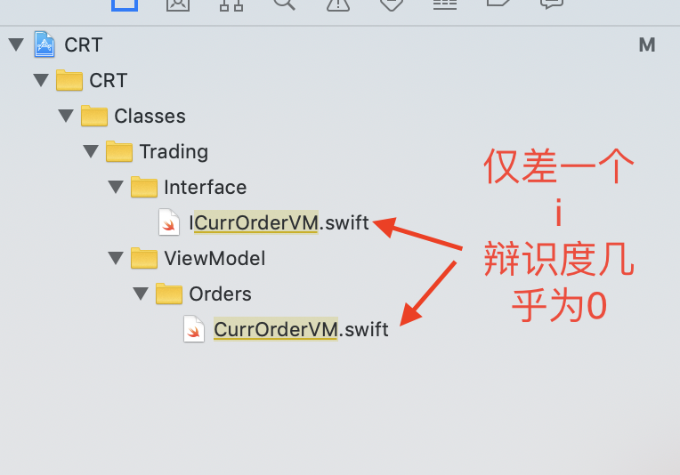
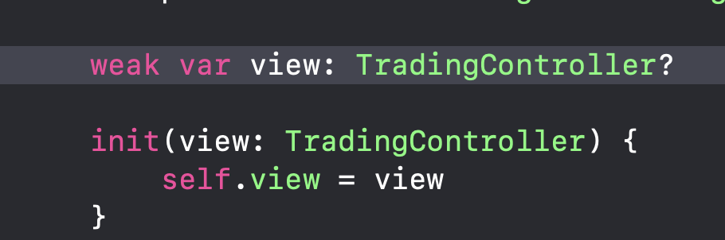
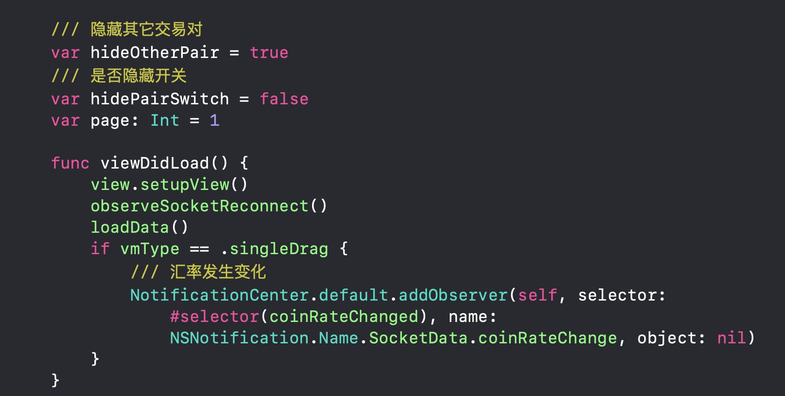
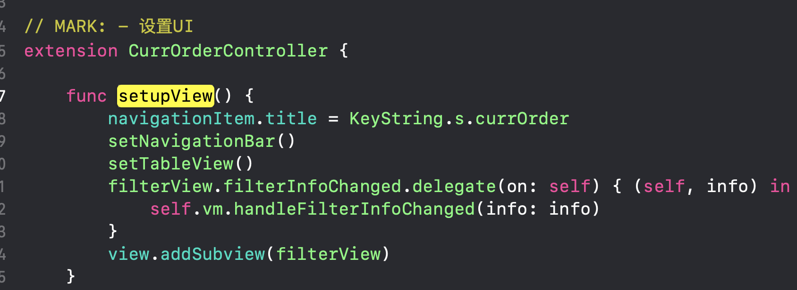

# QB：疏理订单模块，及代码拆分
2019年10月11日，主要工作，把整个订单模块，文件结构整理归类、代码拆分、逻辑精简、了解其中的网络通信流程，请记录相关问题。

##一、代码命名
项目中代码命名，可读性较差，许多类名相似度比较高，比如下图所示，`CurrOrderVM`，`iCurrOrderVM` 命名相差仅有一个前缀 **`i`**，辩识度极小，在维护时，很难注意到相者的区别。



变量名，命名易引起误判，如下图中，`TradingController`是一个控制器`Controller`，命名本应体现期类型，但代码中以`view` 命名，容易误导阅读者认为这是一个`UIView`视图。



* 建议

	1. 书写时，遵循类名书写规范，以**个人标签+功能名**为前缀，后接`类名`，如 `BLCurrentOrderViewModel`，从名称可以推测出，书写者 `BL`，作用 `当前订单`，类别 `viewModel` 模型。
	2. 变量名，遵循驼峰标识，以功能+类型为命名规则，如 `tradingVc`，可以明确解读为以`tradingVc`命名 的控制器对象。

##二、方法、函数调用
代码中有大量在`Controller`中实现的方法、函数，却要在`ViewModel`中创建`Controller`对象调用，一方面容易造成两者的循环引用问题，另一方面，造成两者权责不清，代码维护困难，可读性差，这样的写法，刚开始以为是为了写测试代码，但是阅读了测试代码后，发现似乎这样理解也不合理，建议我们还是以维护性、扩展性、性能优化。


上图中`view.setupView()`方法在`viewModel`中调用，实现却在`CurrOrderController`中实现的，而控制器中又创建了一个`ViewModel`对象调相应的方法。

```
class CurrOrderVM: ICurrOrderVM, ReconnectReloadData {
	/// 控制器对象，这里不知为何，可以当CurrOrderController用
    var view: ICurrOrderView
    
    init(view: ICurrOrderView, type: CurrOrderVMType) {
        self.view = view
        self.vmType = type
    }
    
    func viewDidLoad() {
        view.setupView()
        observeSocketReconnect()
        loadData()
      }
}
```
    
```
class CurrOrderController: BaseViewController, ICurrOrderView { 
   /// viewModel对象
   var vm: ICurrOrderVM!

   override func viewDidLoad() {
        super.viewDidLoad()
        vm.viewDidLoad()
 	}
 	///方法实现
 	func setupView() {   }
 	
}
```

* 建议
	 
	 方法调用应该遵循快捷、高效，当前的写法，却经历了两个对象，三次调用才完成一次方法、函数的调用，而原本可以一次完成的，以后可以尝试，把这种处理方式慢慢淘汰掉。

	 ```
class CurrOrderController: BaseViewController, ICurrOrderView { 

   override func viewDidLoad() {
        super.viewDidLoad()
		  setupView()
    }
     	///方法实现
 	func setupView() {   }
}
	 ```

##三、刷新
刷新写的简直无法用语言形容，简单的刷新操作，写的像跳大神，似乎在炫技？

想实现刷新，要遵循一系列的协议，关键是，整个App，用到刷新的地方好像也不多。

* 刷新步骤
	1. 遵循协议
	
	```
//历史订单界面
class HistoryOrdersController: BaseViewController, BLCurrentOrderBaseView, IRefreshVM 
{
}
	```
其中 `BLCurrentOrderBaseView ` 相关方法
	
	```
import UIKit
protocol BLCurrentOrderBaseView: IBaseView {
  
    func updateTableHeader(newDeal: NewestDeal)
    func setTableViewState(_ state: TableViewDataState)
    func tableNoMoreData()
    func endHeaderRefresh()
    func endFooterRefresh()
    func endRefresh()
    func updateNaviBarState()
    func resetFilterState()
}
extension BLCurrentOrderBaseView {
   
    func updateTableHeader(newDeal: NewestDeal) {}
    func setTableViewState(_ state: TableViewDataState) {}
    func tableNoMoreData() {}
    func endHeaderRefresh() {}
    func endFooterRefresh() {}
    func endRefresh() {}
    func updateNaviBarState() {}
    func setSwitchHidden(isHidden: Bool) {}
    func resetFilterState() {}
}
	```
`IRefreshVM ` 相关方法

	```
	import UIKit
	/// 下拉刷新、上拉加载
	protocol IRefreshVM: IBaseVM {
    var page: Int {get set}
    mutating func pullToRefresh()
    mutating func refreshLoadMore()
    func endRefresh()
}
extension IRefreshVM {
    mutating func pullToRefresh() {
        self.page = 0
        loadData()
    }
    mutating func refreshLoadMore() {
        self.page += 1
        loadData()
    }
    func endRefresh() {}
}

	```
如果不想有这些乱七八糟的协议，可以全不用，尤其 `IRefreshVM`，需要重写

	```
//MARK: 创建历史订单列表
func setTableView() {
       
     /// 这里TM，神逻辑啊，什么都包好几层，干嘛用？？  :Balopy:
    tableView.addPullToRefresh {
      self.page = 1
      self.refreshHistoryList()
    }
    tableView.addLoadMoreRefresh { 
            
      self.page += 1
      self.refreshHistoryList()
    }
}
	```


##四、疑问

###1. 当前订单页面


```
    //MARK: 请求加载当前订单
    func loadCurrentOrderData(response:@escaping(_ state: TableViewDataState)->()) {
        // 监听订单变化
        orderStatusChanged()
    }
```

```
    // 订单状态发生变化
    func orderStatusChanged() {
        
        //判断当前状态下按钮是否打开
        let observeIdentify = String(true)
        
        BLNormalTradeRequest.shared.orderStatusChanged(observeKey:
            classString(from: self) + observeIdentify)
        { [weak self]  (seq, changeOrder) in
        
        }
    }
```

```
    /// 用户的当前订单更新
    func orderStatusChanged(observeKey: String, _ changeOrder: @escaping ((Int, CurrOrder) -> Void)) {
        let dataCallback = { (seq: Int, rootDict: [String: Any]) in
            guard let depthList = CurrOrder.deserialize(from: rootDict) else { return }
            changeOrder(seq, depthList)
        }
        TradingRequest.orderStatusChangedCallbacks[observeKey] = dataCallback
    }
```

订单状态这个方法，是实时监听订单变化？当前的问题是，在撤销订单时，并没有直接调用相关接口，而是通过`orderStatusChanged（） `这个方法更新数据，然后删除订单，但是更新并不及时，且状态有时不对。

###2. 当前委托页面

```
    /// 这里的开关，是干什么用的，好像没有用到  :Balopy:
    lazy var switchButton = UISwitch(frame: CGRect(x: 12, y: 0, width: 46, height: 36))
    
    func setTableView() {
 
        if !iviewModel.hidePairSwitch
        {
            let headerView = UIView(frame: CGRect(x: 0, y: 0, width: SCREEN_WIDTH, height: 36))
            headerView.backgroundColor = UIColor.Common.blackDeep
            switchButton.isOn = false
            switchButton.onTintColor = UIColor.Common.subject
            switchButton.addTarget(self, action: #selector(hiddenSwitchChanged(hideSwitch:)), for: .valueChanged)
            headerView.addSubview(switchButton)
            
            let msgLabel = UILabel(title: KeyString.s.hideOtherPair, titleColor: UIColor.Common.gray828, font: UIFont.fitMediumFont(size: 14), backgroundColor: headerView.backgroundColor!)
            msgLabel.frame = CGRect(x: switchButton.maxX + 8, y: 0, width: 120, height: headerView.height)
            headerView.addSubview(msgLabel)
            view.addSubview(headerView)
            tableView.y = 36
        }
    }
```

